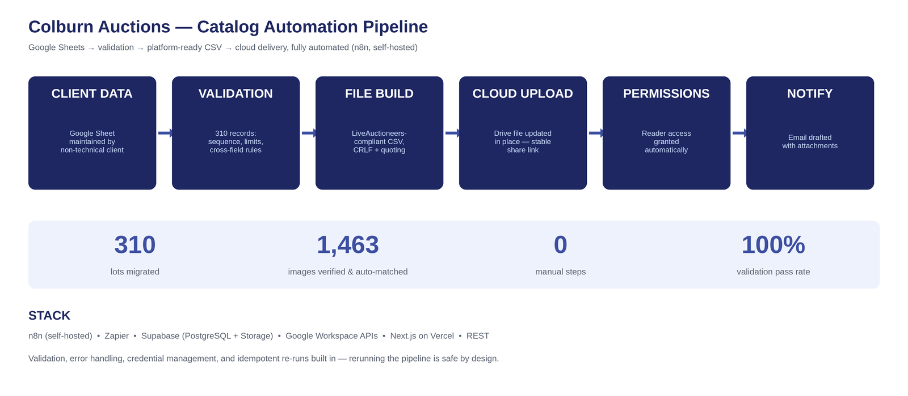

# Colburn Auctions — Full-Stack Auction Platform & Catalog Automation

**Real client. Real deadline. 310 lots, 1,463 photos, zero manual steps.**

A 40-year antique auction house needed to go from paper catalogs to a live online auction on LiveAuctioneers — website, database, photo pipeline, and platform migration — delivered by a hard auction date.

## Proof (live, public)

| What | Where |
|---|---|
| Live client website | https://www.colburnauctions.com |
| Public catalog (310 lots, photo galleries) | https://www.colburnauctions.com/catalog |
| LiveAuctioneers auction listing | *(link added on auction day)* |

*Screenshots below are from the production system — not mockups.*

<!-- ADD: 3 screenshots side by side: website catalog page, admin panel, LiveAuctioneers imported catalog -->

## What was built

**1. Client website + database** — Next.js on Vercel, Supabase (PostgreSQL + Storage). Public catalog with lot detail galleries and lazy loading; admin panel with pagination handling 1,400+ photos without browser overload.

**2. Photo pipeline** — 1,463 images renamed to the platform's `LotNumber-index` convention, exported from Supabase Storage to Google Drive via a batched n8n workflow, and reconciled against a database manifest: every file verified present, duplicates detected and removed.

**3. Catalog automation** (diagram above) — the client edits one Google Sheet; a workflow validates all 310 records (lot sequence, title length limits, estimate cross-checks), builds a LiveAuctioneers-compliant CSV, updates the shared Drive file in place, and manages access permissions. Client-facing changes (a price update on auction week) went from request to delivered file in under a minute — by rerunning the pipeline, not editing files by hand.

**4. Plain-language operations docs** — upload guides written so a non-technical owner operates the auction platform himself.

## Engineering decisions worth noting

- **Idempotent delivery**: the final CSV is updated *in place* on Drive so shared links never break — rebuilds are safe at any time.
- **Validation as a gate**: the pipeline refuses to build on bad data (sequence gaps, over-length titles, inverted estimates) and reports exactly which record failed.
- **Batched external calls**: photo export runs in batches with retry handling to survive API rate limits.
- **Least-privilege sharing**: client gets reader access to exactly two artifacts, granted programmatically.

## Stack

`n8n (self-hosted)` · `Supabase — PostgreSQL + Storage` · `Next.js / Vercel` · `Google Workspace APIs (Sheets, Drive, Gmail)` · `Zapier` · `REST`

---

*Part of the BVOS venture portfolio — built and operated by [Nurudeen Bode Ayansina](https://github.com/Bode-N-Ayansina).*
